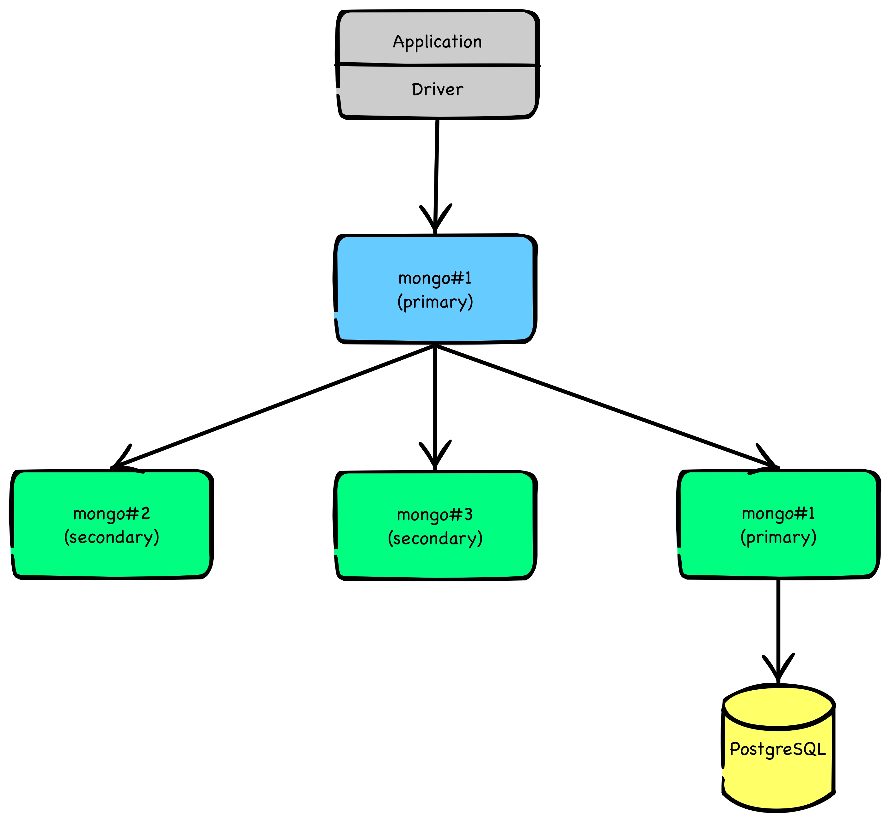
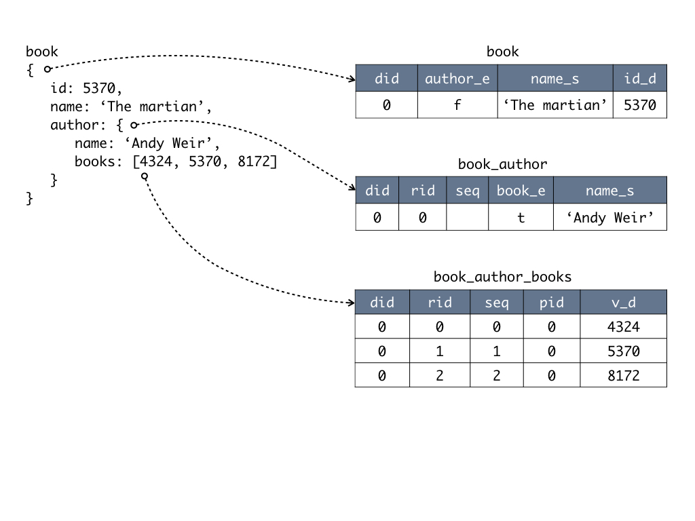

<h1>What is ToroDB Stampede?</h1>

ToroDB Stampede is a replication and mapping technology to maintain a live mirror of a MongoDB database (or [sub-set](configuration/filtered-replication.md)) in a SQL database. ToroDB Stampede uses [MongoDB's replica set oplog](https://docs.mongodb.com/manual/core/replica-set-oplog/) to keep track of the modifications in MongoDB.

During replication ToroDB Stempede transforms MongoDB's JSON documents into a [relational schema](relational-schema) that allows certain queries (such as aggregates) to complete faster as running against JSON documents.

## Current Limitations

### SQL Target

Currently, ToroDB Stampede only supports the free open-source databases [PostgreSQL](https://www.postgresql.org/) and [MySQL](https://www.mysql.com/) (and compatible databases) as targets.

### MongoDB

ToroDB Stampede only supports MongoDB 3.2 and 3.4 at the moment.

The following MongoDB features are not yet supported:

* [Capped collections](https://docs.mongodb.com/manual/core/capped-collections/)
* The [collMod](https://docs.mongodb.com/manual/reference/command/collMod/) command
* The [applyOps](https://docs.mongodb.com/manual/reference/command/applyOps/) command (will stop the replication server)
* The character `\0` is escaped in strings because PostgreSQL doesn't support it.

The automatic creation of indexes in the target database is currently limited as follows:

* Only simple one-key indexes (ascending and descending - those that ends in 1 and -1 when declared in MongoDB)
* Index properties `sparse` and `background` are ignored
* All keys path with the exception to the paths resolving in scalar value (e.g.: `db.test.createIndex({"a": 1})` will not index value of key `a` for the document `{"a": [1,2,3]}`)

## Incompatible Document Designs

The main benefit of ToroDB Stampede is to flatten nested documents into tables. There are some patterns that cause the relational tables to end up with a very high number of columns—possibly up to the limitation of the SQL backend (in PostgreSQL about 1600 columns).

* **Pattern "key as values"**  
  Document key-names are turned into columns of tables. If you store values in the key-names, the table will have as many columns as you have distinct key-names.

* **Too many fields per document**  
  If several of them are optional and only some of them appear in each document, there might be thousands of columns.

[TODO]: <> ('All keys path with the exception to the paths resolving in scalar value' might be wrong (given the example that relsolved to an array). Might mean "resolving in non-scalar values"?)

[TODO]: <> (Which PostreSQL version is required?)

[TODO]: <> (Which MySQL version is required?)

[TODO]: <> (not supported types, we need a list)

[Versions]: <> (this section doesn't make any sense currently)

[Documentation conventions]: <> (we have no time right now for this section)
