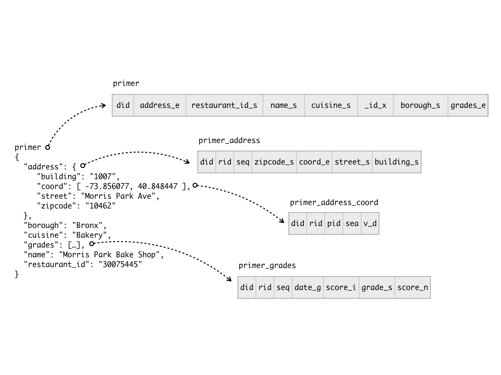
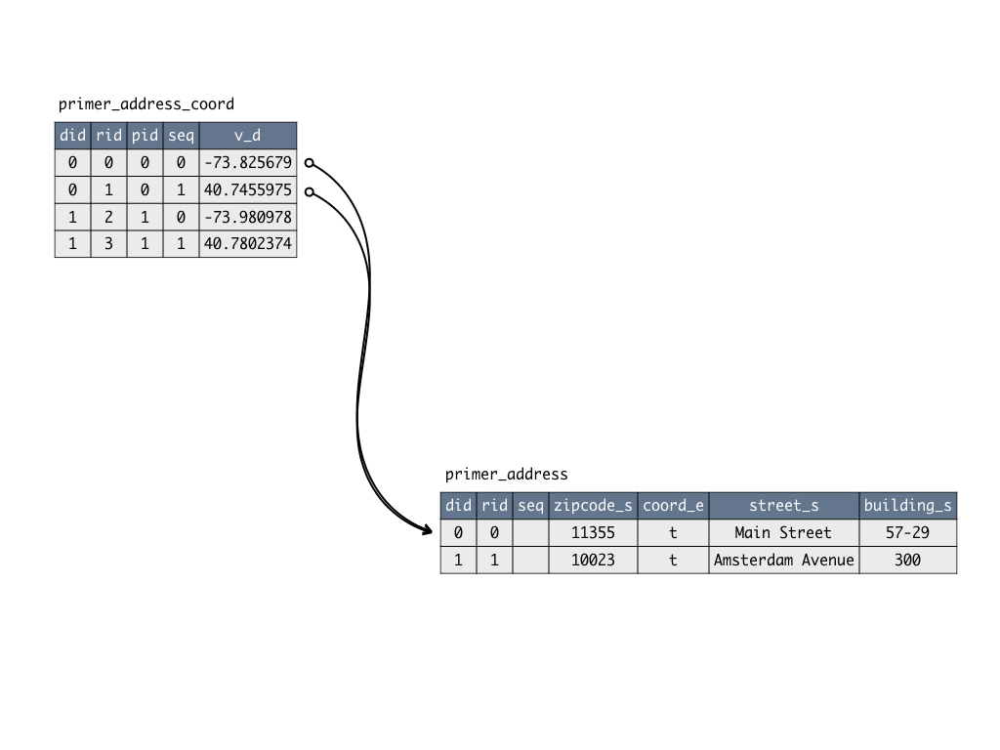

<h1>How to use</h1>

To understand better how the JSON document to relational storage mapping algorithm works, one example will be done using a known [dataset](https://docs.mongodb.com/getting-started/shell/import-data/) from MongoDB documentation.

Given that ToroDB Stampede and all its requisites are met, the dataset will be imported into MongoDB to be replicated in PostgreSQL. This is done with next commands.

```
$ wget https://www.dropbox.com/s/570d4tyt4hpsn03/primer-dataset.json?dl=0

$ mongoimport -d stampede -c primer primer-dataset.json
```

The import was done with database `stampede` and collection `primer`, this is important because it determines the schema and table names created in the relational storage. In PostgreSQL the replication is done in the `torod` database, schema `stampede` with one root table #`primer` and some associated tables named like `primer_*`.

## Table mapping

Essentially, each level of the JSON document is mapped to a different table in the relational backend. The structure of each document in the given dataset complies with the following structure.

```
{
  "address": {
     "building": "1007",
     "coord": [ -73.856077, 40.848447 ],
     "street": "Morris Park Ave",
     "zipcode": "10462"
  },
  "borough": "Bronx",
  "cuisine": "Bakery",
  "grades": [
     { "date": { "$date": 1393804800000 }, "grade": "A", "score": 2 },
     { "date": { "$date": 1378857600000 }, "grade": "A", "score": 6 },
     { "date": { "$date": 1358985600000 }, "grade": "A", "score": 10 },
     { "date": { "$date": 1322006400000 }, "grade": "A", "score": 9 },
     { "date": { "$date": 1299715200000 }, "grade": "B", "score": 14 }
  ],
  "name": "Morris Park Bake Shop",
  "restaurant_id": "30075445"
}
```

So 4 tables will be created representing each different level from the document. One root table with name `primer`, because it is the collection name at `mongoimport` command. And another three tables representing the childs of the root document.

* primer_address
* primer_address_coord
* primer_grades



### Created tables

#### primer

As stated above, the root of the document is mapped to a table with the name used as collection name, it is `primer`.

Each element of the root level is mapped to a different column of the table, either an scalar or subdocument. Next chapter contains the different datatypes that can be created in the relational schema. All of them are indicated as a postfix of the column name, for example `cuisine` key is created as `cuisine_s` because it contains string values.

```
did  | address_e | restaurant_id_s |                                               name_s                                               |                            cuisine_s                             |           _id_x            |   borough_s   | grades_e
-----+-----------+-----------------+----------------------------------------------------------------------------------------------------+------------------------------------------------------------------+----------------------------+---------------+----------
   0 | f         | 40384115        | Phil & Sons Restaurant & Pizzeria                                                                  | Pizza/Italian                                                    | \x580f12efbe6e3fff2237caef | Queens        | t
   1 | f         | 40384100        | Josie'S Restaurant                                                                                 | American                                                         | \x580f12efbe6e3fff2237caee | Manhattan     | t
   2 | f         | 40384036        | Mcdonald'S                                                                                         | Hamburgers                                                       | \x580f12efbe6e3fff2237caed | Brooklyn      | t
   3 | f         | 40383945        | Pizza D'Oro                                                                                        | Pizza                                                            | \x580f12efbe6e3fff2237caec | Staten Island | t
   4 | f         | 40383931        | Flash Dancers                                                                                      | American                                                         | \x580f12efbe6e3fff2237caeb | Manhattan     | t
   5 | f         | 40383836        | Barone Pizza                                                                                       | Pizza                                                            | \x580f12efbe6e3fff2237caea | Queens        | t
   6 | f         | 40383825        | Russian Samovar                                                                                    | Russian                                                          | \x580f12efbe6e3fff2237cae9 | Manhattan     | t
   7 | f         | 40383819        | Short Stop Restaurant                                                                              | American                                                         | \x580f12efbe6e3fff2237cae8 | Bronx         | t
```

#### primer_address

```
did  |  rid  | seq | zipcode_s | coord_e |                street_s                | building_s
-----+-------+-----+-----------+---------+----------------------------------------+------------
   0 |     0 |     | 11355     | t       | Main Street                            | 57-29
   1 |     1 |     | 10023     | t       | Amsterdam Avenue                       | 300
   2 |     2 |     | 11207     | t       | Pennsylvania Avenue                    | 819
   3 |     3 |     | 10314     | t       | Victory Boulevard                      | 3115
   4 |     4 |     | 10019     | t       | Broadway                               | 1674
   5 |     5 |     | 11354     | t       | Main Street                            | 4027
   6 |     6 |     | 10019     | t       | West   52 Street                       | 256
   7 |     7 |     | 10463     | t       | Broadway                               | 5977
```

#### primer_address_coord

The table `primer_address_coord` is a special case, like `primer_grades`, because those paths contain an array. That is the reason why a column `seq` is used in those tables, indicating the position of the element in the original arrays. To understand better the metadata columns it is recommended to read the chapter [metada](how-to-use.md#metadata).

```
did  |  rid  |  pid  | seq |     v_d      
-----+-------+-------+-----+--------------
   0 |     0 |     0 |   0 |   -73.825679
   0 |     1 |     0 |   1 |   40.7455975
   1 |     2 |     1 |   0 |  -73.9809789
   1 |     3 |     1 |   1 |   40.7802374
   2 |     4 |     2 |   0 |  -73.8896643
   2 |     5 |     2 |   1 |   40.6578505
   3 |     6 |     3 |   0 |  -74.1630372
   3 |     7 |     3 |   1 |     40.60731
   4 |     8 |     4 |   0 |   -73.982872
   4 |     9 |     4 |   1 |   40.7628094
   5 |    10 |     5 |   0 |   -73.829714
   5 |    11 |     5 |   1 |   40.7587648
   6 |    12 |     6 |   0 |   -73.984752
   6 |    13 |     6 |   1 |    40.763105
   7 |    14 |     7 |   0 |  -73.8982704
   7 |    15 |     7 |   1 |   40.8896923
```

#### primer_grades

```
did  |  rid  | seq |         date_t         | score_i |    grade_s     | score_n
-----+-------+-----+------------------------+---------+----------------+---------
   0 |     0 |   0 | 2014-08-21 02:00:00+02 |       6 | A              |
   0 |     1 |   1 | 2014-02-03 01:00:00+01 |      19 | B              |
   0 |     2 |   2 | 2013-04-13 02:00:00+02 |       7 | A              |
   0 |     3 |   3 | 2012-10-17 02:00:00+02 |       9 | A              |
   0 |     4 |   4 | 2011-10-22 02:00:00+02 |      10 | A              |
   1 |     5 |   0 | 2014-02-20 01:00:00+01 |      10 | A              |
   1 |     6 |   1 | 2013-07-22 02:00:00+02 |      12 | A              |
   1 |     7 |   2 | 2012-06-25 02:00:00+02 |      10 | A              |
   1 |     8 |   3 | 2011-11-16 01:00:00+01 |      22 | B              |
   1 |     9 |   4 | 2011-04-26 02:00:00+02 |      12 | A              |
   2 |    10 |   0 | 2014-04-24 02:00:00+02 |       3 | A              |
   2 |    11 |   1 | 2013-10-10 02:00:00+02 |       4 | A              |
   2 |    12 |   2 | 2013-05-08 02:00:00+02 |       2 | A              |
   2 |    13 |   3 | 2012-11-23 01:00:00+01 |       7 | A              |
   2 |    14 |   4 | 2012-03-05 01:00:00+01 |      19 | B              |
   2 |    15 |   5 | 2011-09-22 02:00:00+02 |      12 | A              |
   2 |    16 |   6 | 2011-08-16 02:00:00+02 |       3 | P              |
   3 |    17 |   0 | 2014-08-07 02:00:00+02 |      21 | B              |
   3 |    18 |   1 | 2014-01-07 01:00:00+01 |      13 | A              |
   3 |    19 |   2 | 2012-10-09 02:00:00+02 |      13 | A              |
   3 |    20 |   3 | 2011-10-18 02:00:00+02 |       4 | A              |
   4 |    21 |   0 | 2014-02-20 01:00:00+01 |       8 | A              |
   4 |    22 |   1 | 2013-01-25 01:00:00+01 |      13 | A              |
   4 |    23 |   2 | 2011-12-27 01:00:00+01 |      10 | A              |
   5 |    24 |   0 | 2014-11-13 01:00:00+01 |      16 | B              |
   5 |    25 |   1 | 2014-04-16 02:00:00+02 |       7 | A              |
   5 |    26 |   2 | 2013-10-10 02:00:00+02 |       5 | A              |
   5 |    27 |   3 | 2013-03-08 01:00:00+01 |       9 | A              |
   5 |    28 |   4 | 2012-08-22 02:00:00+02 |      44 | C              |
   6 |    29 |   0 | 2014-12-30 01:00:00+01 |      40 | Z              |
   6 |    30 |   1 | 2014-05-29 02:00:00+02 |      10 | A              |
   6 |    31 |   2 | 2013-09-24 02:00:00+02 |      10 | A              |
   6 |    32 |   3 | 2013-02-12 01:00:00+01 |      18 | B              |
   6 |    33 |   4 | 2012-05-11 02:00:00+02 |       6 | A              |
   7 |    34 |   0 | 2014-05-30 02:00:00+02 |       6 | A              |
   7 |    35 |   1 | 2013-04-25 02:00:00+02 |       7 | A              |
   7 |    36 |   2 | 2012-11-20 01:00:00+01 |      12 | A              |
   7 |    37 |   3 | 2012-05-30 02:00:00+02 |      10 | A              |
   7 |    38 |   4 | 2011-12-19 01:00:00+01 |      18 | B              |
```

## Columns and metadata

[TODO]: <> (explain the possible values of `_e`)

As it can be observed in the tables extracts above, the column names contains a postfix, it indicates the data type. In JSON there are no data type constraints but there are in a relational storage, so if one path contains two different data types two different columns are created (view more info at [Data conflict resolution](how-to-use.md#data-conflict-resolution))

The different data types used by ToroDB Stampede are represented in the table below.

| Postfix | What does it mean? |
|---------|--------------------|
| _b | Boolean value, stored as a boolean in PostgreSQL. |
| _c | A date (with time) value in format ISO-8601, stored with PostgreSQL type date. |
| _d | A 64-bit IEEE 754 floating point, stored with PostgreSQL type double precision. |
| _e | A child element, it can be an object or an array, stored with PostgreSQL type boolean with a value of false to indicate a child object and true to indicate a child array. |
| _i | A 32-bit signed two's complement integer, stored with PostgreSQL type integer. |
| _l | A 64-bit signed two's complement integer, stored with PostgreSQL type bigint. |
| _n | A null value, stored with PostgreSQL type boolean (nullable). It cannot take value false, just true or null. When the value is true means the JSON document has value null for that path, when it is null it means the path has another value or does not exist for that document. |
| _m | A time value in format ISO-8601, stored with PostgreSQL type time. |
| _r | Binary object, it is an array of bytes stored in PostgreSQL as bytea. |
| _s | An array of UTF-8 characters representing a text, stored with PostgreSQL type character varying. |
| _t | Number of milliseconds from 1970-01-01T00:00:00Z, stored with PostgreSQL type timestamptz. |
| _x | This represent the MONGO_OBJECT_ID and it is stored as a PostgreSQL bytea. |
| _y | This represent the MONGO_TIMESTAMP and it is stored as a PostgreSQL composite type formed by an integer column secs and an integer column counter. |

__Notes about MONGO_OBJECT_ID__: ObjectIds are small, likely unique, fast to generate, and ordered. ObjectId values consists of 12-bytes, where the first four bytes are a timestamp that reflect the ObjectId’s creation, specifically:

* 4-byte value representing the seconds since the Unix epoch,
* 3-byte machine identifier,
* 2-byte process id, and
* 3-byte counter, starting with a random value.

### Data conflict resolution

Because the JSON documents nature, it can happen that the same path contains different data types or even in some documents the path doesn't exist. That is not a problem for the JSON document but it is for a relational storage where each column should have an associated data type.

To solve this problem in ToroDB Stampede, each data type has a different column. For example, in the `primer_grades` table there are two different columns for the `score` key. One is `score_i` that represents the integer values and another one is `score_n` that represents when that value contains null in the original document (because it is mandatory to detect when null value was given and when the path was not given).

```
did   |  rid  | seq |         date_t         | score_i |    grade_s     | score_n
------+-------+-----+------------------------+---------+----------------+---------
    0 |     0 |   0 | 2014-08-21 02:00:00+02 |       6 | A              |
    0 |     1 |   1 | 2014-02-03 01:00:00+01 |      19 | B              |
    0 |     2 |   2 | 2013-04-13 02:00:00+02 |       7 | A              |
    0 |     3 |   3 | 2012-10-17 02:00:00+02 |       9 | A              |
    0 |     4 |   4 | 2011-10-22 02:00:00+02 |      10 | A              |
    1 |     5 |   0 | 2014-02-20 01:00:00+01 |      10 | A              |
    1 |     6 |   1 | 2013-07-22 02:00:00+02 |      12 | A              |
    1 |     7 |   2 | 2012-06-25 02:00:00+02 |      10 | A              |
    1 |     8 |   3 | 2011-11-16 01:00:00+01 |      22 | B              |
    1 |     9 |   4 | 2011-04-26 02:00:00+02 |      12 | A              |
 7148 | 34375 |   0 | 2015-01-20 01:00:00+01 |         | Not Yet Graded | t
22559 | 91238 |   0 | 2015-01-20 01:00:00+01 |         | Not Yet Graded | t
23204 | 91961 |   0 | 2015-01-20 01:00:00+01 |         | Not Yet Graded | t
23392 | 92137 |   0 | 2015-01-20 01:00:00+01 |         | Not Yet Graded | t

```

The rows with value `true` for column `score_n` means the associated JSON document had a value null for path `score` like it is shown in the next example.

```
{
    "address": {
        "building": "725",
        "coord": [-74.01381169999999, 40.6336821],
        "street": "65 Street",
        "zipcode": "11220"
    },
    "borough": "Brooklyn",
    "cuisine": "Other",
    "grades": [{
        "date": {
            "$date": 1421712000000
        },
        "grade": "Not Yet Graded",
        "score": null
    }],
    "name": "Swedish Football Club",
    "restaurant_id": "41278206"
}
```

### Metadata

As stated above, ToroDB Stampede stores different metadata to be able to the document, recompose it or execute different complex queries. These metadata can be columns in the data tables or even specific metadata tables for internal usage.

#### Metadata columns

ToroDB Stampede creates different metadata columns in the data tables.

| Column | What does it? |
|--------|---------------|
| did | It is the unique identifier of the document and it has the same value for all rows related to the same document. |
| rid | It is the unique identifier of the row, for example when an array is mapped the rid is different for each row but the did is the same. |
| pid | It is the reference to the parent rid. For example, `primer_address_coord` has elements with rid 0 and 1 and pid 0, that means they are childs of row with rid 0 at `primer_address`. |
| seq | Represents the position of an element inside the original array. |



#### Metadata tables

The metadata columns in the data tables are not enough to keep the data integrity, so there are some special metadata tables at the schema `torodb`.

##### database

Table `database` stores the name given by the user to the database in MongoDB, that is stored in a schema in PostgreSQL. Because PostgreSQL has limits on the database names it is dereferenced here, but usually the values are the same unless a very large name is used.

```
# select * from database;

   name   | identifier
----------+------------
 stampede | stamped
```

##### collection

Among the name of the database one, collection name was given in MongoDB layer, so it is stored in the table `collection` dereferencing it in the same way.

```
# select * from collection;

 database |       name        |        identifier        
----------+-------------------+--------------------------
 stampede | primer            | stampede_primer
```

##### doc_part

As stated above, the name of the table for the root element is the same one used in the MongoDB collection name. In ToroDB Stampede the `table_ref` associated to that element is `{}` and its identifier is the collection dereferenced name, here `primer`.

With larger paths, like `address.coord`, the table ref will be the composition of the path, so `{address,coord}`. And the table identifier will be the concatenation of the dereferenced names of collection and path identifiers `primer_address_coord`.

```
# select * from doc_part;

 database |    collection     |        table_ref        |               identifier                | last_rid
----------+-------------------+-------------------------+-----------------------------------------+----------
 stampede | primer            | {}                      | primer                                  |        0
 stampede | primer            | {address}               | primer_address                          |        0
 stampede | primer            | {grades}                | primer_grades                           |        0
 stampede | primer            | {address,coord}         | primer_address_coord                    |        0
```

##### field

`field` table stores the data type of each column and its identifier. For a given combination of `database, collection, table_ref`, the used name of the column is stored and the data type associated. This data type can be either a scalar value, like `string` or `double`, or a `child` type (this means an associated table exists)

```
# select * from field;

 database |    collection     |        table_ref        |         name          |      type       |       identifier        
----------+-------------------+-------------------------+-----------------------+-----------------+-------------------------
 stampede | primer            | {}                      | address               | CHILD           | address_e
 stampede | primer            | {}                      | restaurant_id         | STRING          | restaurant_id_s
 stampede | primer            | {}                      | name                  | STRING          | name_s
 stampede | primer            | {}                      | cuisine               | STRING          | cuisine_s
 stampede | primer            | {}                      | _id                   | MONGO_OBJECT_ID | _id_x
 stampede | primer            | {}                      | borough               | STRING          | borough_s
 stampede | primer            | {}                      | grades                | CHILD           | grades_e
 stampede | primer            | {address}               | zipcode               | STRING          | zipcode_s
 stampede | primer            | {address}               | coord                 | CHILD           | coord_e
 stampede | primer            | {address}               | street                | STRING          | street_s
 stampede | primer            | {address}               | building              | STRING          | building_s
 stampede | primer            | {grades}                | date                  | INSTANT         | date_t
 stampede | primer            | {grades}                | score                 | INTEGER         | score_i
 stampede | primer            | {grades}                | grade                 | STRING          | grade_s
 stampede | primer            | {grades}                | score                 | NULL            | score_n
```

##### scalar

`scalar` table is used to store the data type of the element of an array. This is because an array can contains different type of data in a JSON document.

In the given example, the only row in `scalar` table is related to the path `address.coord` with type `double`. This means that column `v_d` in the table `stampede_address_coord` is a `double`.

```
# select * from scalar;

 database | collection |    table_ref    |  type  | identifier
----------+------------+-----------------+--------+------------
 stampede | primer     | {address,coord} | DOUBLE | v_d
```

## Example queries

The data in the relational storage can be queries like any other relational dataset, using the `psql` command or any other tool able to connect to PostgreSQL.

For example, the name of all bakeries in the ZIP code 10462, could be:

```
select p.name_s from primer p, primer_address pa
where
  p.cuisine_s = 'Bakery'
  and p.did = pa.did
  and pa.zipcode_s = '10462'
```

```
# select p.name_s from primer p, primer_address pa where p.cuisine_s = 'Bakery' and p.did = pa.did and pa.zipcode_s = '10462';

               name_s                
-------------------------------------
 Morris Park Bake Shop
 Zaro'S Bread Basket
 Ronald Pitusa Bakery
 National Bakery
 Conti'S Pastry Shoppe
 Gina'S Italian Bakery & Pastry Shop
 Mr Cake Bakery & Dessert
```

One of the advantages having the data in a relational format is the ability to execute complex queries in a fast and efficient way. For example, to the previous query, the average score of each bakery could be added with just a few lines.

```
select p.name_s, avg(pg.score_i)
from primer p, primer_address pa, primer_grades pg
where
  p.cuisine_s = 'Bakery'
  and p.did = pa.did
  and pa.zipcode_s = '10462'
  and pg.did = p.did
group by p.name_s
```

```
# select p.name_s, avg(pg.score_i) from primer p, primer_address pa, primer_grades pg where p.cuisine_s = 'Bakery' and p.did = pa.did and pa.zipcode_s = '10462' and pg.did = p.did group by p.name_s;

               name_s                |         avg         
-------------------------------------+---------------------
 Conti'S Pastry Shoppe               | 10.3333333333333333
 Gina'S Italian Bakery & Pastry Shop | 18.3333333333333333
 Zaro'S Bread Basket                 |  8.1666666666666667
 Mr Cake Bakery & Dessert            | 12.0000000000000000
 Ronald Pitusa Bakery                |  9.0000000000000000
 Morris Park Bake Shop               |  8.2000000000000000
 National Bakery                     | 12.4000000000000000
```

And one filter can be applied with a few lines more, keeping query very simple and the execution time responsive.

```
select p.name_s, avg(pg.score_i)
from primer p, primer_address pa, primer_grades pg
where
  p.cuisine_s = 'Bakery'
  and p.did = pa.did
  and pa.zipcode_s = '10462'
  and pg.did = p.did
group by p.name_s
having avg(pg.score_i) > 10
```

```
# select p.name_s, avg(pg.score_i) from primer p, primer_address pa, primer_grades pg where p.cuisine_s = 'Bakery' and p.did = pa.did and pa.zipcode_s = '10462' and pg.did = p.did group by p.name_s having avg(pg.score_i) > 10;

               name_s                |         avg         
-------------------------------------+---------------------
 Conti'S Pastry Shoppe               | 10.3333333333333333
 Gina'S Italian Bakery & Pastry Shop | 18.3333333333333333
 Mr Cake Bakery & Dessert            | 12.0000000000000000
 National Bakery                     | 12.4000000000000000
```
